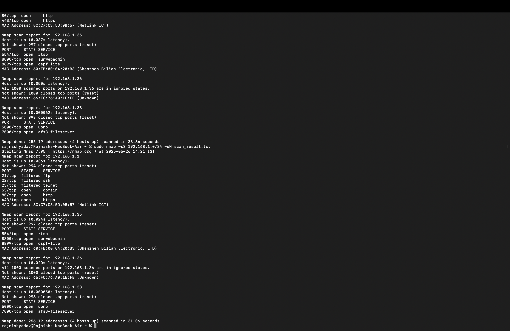

# Update the README.md content to reflect that the user performed the task on macOS instead of Windows.

readme_content_mac = """# 🔍 Cybersecurity Task 1 – Network Port Scanning with Nmap

## 🛠 Tools Used

- **Nmap** – for scanning devices and ports in the local network
- **Terminal (macOS)** – to run Nmap commands

---

## 📡 Steps I Followed

1. **Installed Nmap** using Homebrew:
    brew install nmap
2. **Found my local IP address and subnet** using `ifconfig`.  
My local IP was something like `192.168.1.5`, so I used the range `192.168.1.0/24`.
3. **Performed a TCP SYN scan** with the command:
4. **Noted down all the devices** detected in the network and the open ports on each.
5. Saved the scan results using:
6. ## 📷 Screenshots

### Nmap Scan Result

